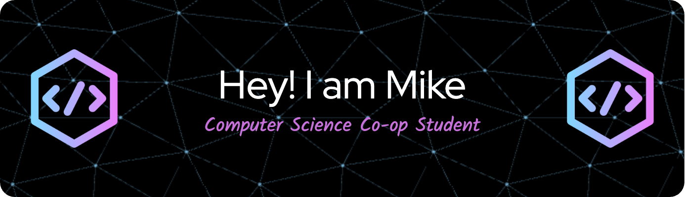

<!--horizontal divider(gradiant)-->

## About me
* I am currently a third year student from Carleton University in Computer Science with specialization in AI & Machine Learining 🤖:

* I am currently a Student Programmer at @CFIA :toolbox:.

## Skills

